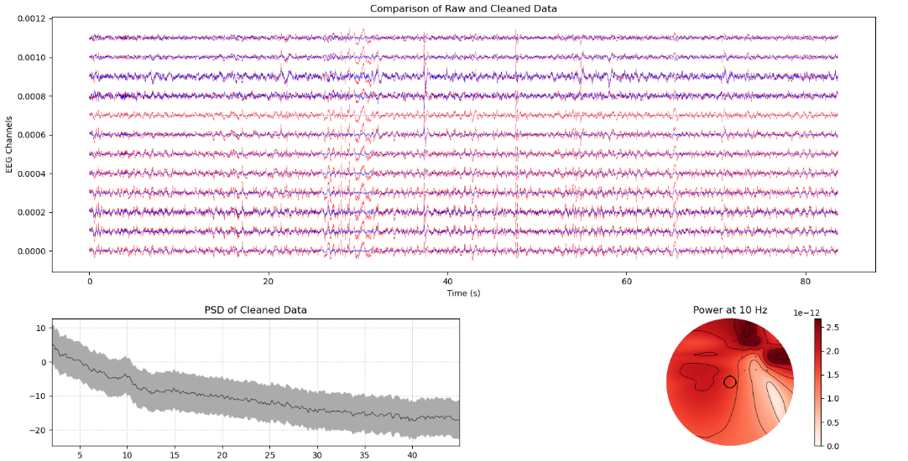

# EEG Quality Check & Preprocessing - Professional Edition

<div align="center">


**A modern, GUI-based EEG preprocessing and quality assessment tool with comprehensive metrics and method comparison.**

</div>

---

## 🌟 Features

### ✨ Modern GUI Interface
- **Intuitive PyQt5-based interface** with professional styling
- **Real-time progress tracking** with detailed status updates
- **Interactive visualizations** with matplotlib integration
- **Tabbed results display** for easy navigation

### 🔬 Comprehensive Quality Metrics
Industry-standard EEG quality metrics including:
- **Signal-to-Noise Ratio (SNR)** - Measures data quality
- **PSD Slope Analysis** - 1/f noise characteristics
- **Artifact Detection** - Amplitude and gradient-based
- **Bad Channel Detection** - Variance-based identification
- **Kurtosis Analysis** - Outlier and artifact indicator
- **Frequency Band Powers** - Delta, Theta, Alpha, Beta, Gamma
- **Channel Correlation** - Inter-channel relationship analysis
- **Overall Quality Score** - Weighted composite score (0-100)
- **Quality Grade** - Letter grade from F to A+

### 🛠️ Two Preprocessing Methods Compared

#### 1️⃣ **Traditional Method: ASR + ICA**
Your original method combining proven techniques:
- Channel selection and average referencing
- Bandpass filtering (1-80 Hz)
- Notch filtering (60 Hz power line)
- **ASR (Artifact Subspace Reconstruction)** - Removes artifact subspaces
- **ICA with ICLabel** - Automatic brain vs. artifact component classification
- Removes: eye blinks, muscle artifacts, heartbeat, line noise

**Strengths:**
- Well-established method with extensive validation
- ASR effectively removes high-amplitude artifacts
- ICLabel provides automatic component classification
- Fast processing with good results

#### 2️⃣ **GEDAI Method: Eigenvalue-Based** (New!)
Novel eigenvalue decomposition approach:
- Channel selection and average referencing
- Bandpass filtering (1-80 Hz)
- Notch filtering (60 Hz)
- **GEVD (Generalized Eigenvalue Decomposition)** - Separates signal/noise subspaces
- **Theoretical signal modeling** - Uses EEG physics knowledge
- **Automatic thresholding** - No manual component selection needed

**Key Innovation:**
- Uses theoretical knowledge of brain signals (not blind like ICA/PCA)
- Computes two covariance matrices (signal vs. noise)
- Solves: S * v = λ * R * v (generalized eigenvalue problem)
- Keeps components that match expected brain signal characteristics

**Strengths:**
- Outperforms ASR/ICA in many scenarios (per recent research)
- Better preservation of brain signals
- Automatic separation without training data
- Novel approach based on EEG generation physics

### 📊 Before/After Comparison
- **Visual comparison** of raw vs. cleaned signals
- **PSD (Power Spectral Density)** plots
- **Frequency band analysis** with visual markers
- **Side-by-side metrics** comparison

### ⚖️ Method Comparison
When "Both" methods are selected:
- **Head-to-head comparison** of ASR+ICA vs. GEDAI
- **Detailed metric-by-metric analysis** across all quality metrics
- **Winner determination** based on overall quality scores
- **Improvement percentages** showing which method cleans better
- **Recommendation** for which method to use for your specific data

---

## 📦 Installation

### Prerequisites
- Python 3.8 or higher
- pip package manager

### Step 1: Clone the Repository
```bash
git clone https://github.com/yourusername/EEG_Preprocessing-and-Quality-Check.git
cd EEG_Preprocessing-and-Quality-Check
```

### Step 2: Create Virtual Environment (Recommended)
```bash
python -m venv venv
source venv/bin/activate  # On Windows: venv\Scripts\activate
```

### Step 3: Install Dependencies
```bash
pip install -r requirements.txt
```

### Required Packages
- **mne** - EEG data processing
- **PyQt5** - GUI framework
- **numpy** - Numerical computations
- **scipy** - Scientific computing
- **matplotlib** - Visualization
- **asrpy** - ASR artifact removal (for GEDAI method)
- **mne-icalabel** - Automatic ICA component labeling

---

## 🚀 Usage

### Launch the GUI
```bash
python eeg_quality_gui.py
```

### Step-by-Step Guide

1. **Select EEG Data File**
   - Click "Browse..." button
   - Select an EEGLAB `.set` file
   - File path will be displayed

2. **Choose Preprocessing Method**
   - **Traditional**: ASR + ICA + ICLabel (your original method)
   - **GEDAI**: Eigenvalue-based denoising (new method to test)
   - **Both**: Compare both methods side-by-side (Recommended!)

3. **Start Processing**
   - Click "🚀 Start Processing" button
   - Monitor progress bar and status messages
   - Processing time varies based on data size and method

4. **View Results**
   - **Original Data Metrics**: Quality assessment of raw data
   - **Processed Metrics**: Quality assessment after cleaning
   - **Visualizations**: Before/after signal and PSD plots
   - **Processing Logs**: Detailed step-by-step logs
   - **Method Comparison** (if "Both" selected): Side-by-side analysis

---

## 📊 Understanding Quality Metrics

### Overall Quality Score (0-100)
A weighted composite score based on multiple metrics:
- **90-100**: Excellent (A+) - Research-grade data
- **80-89**: Very Good (A) - High quality, minimal artifacts
- **70-79**: Good (B) - Acceptable for most analyses
- **60-69**: Fair (C) - May require additional cleaning
- **50-59**: Poor (D) - Significant artifacts present
- **0-49**: Very Poor (F) - Consider data re-collection

### Key Metrics Explained

#### Signal-to-Noise Ratio (SNR)
- Measures signal quality vs. high-frequency noise
- **Higher is better** (>10 dB is good)
- Low SNR indicates noisy data

#### PSD Slope
- Characterizes 1/f noise properties
- **More negative is better** (steeper slope)
- Slope ≥ 0: Garbage quality
- Slope < -0.3: Excellent quality

#### Artifact Percentage
- Estimates data contaminated by artifacts
- **Lower is better** (<10% is excellent)
- Based on amplitude and gradient analysis

#### Bad Channels
- Channels with abnormal variance
- **Fewer is better** (<10% channels)
- Automatically detected and interpolated

#### Kurtosis
- Measures distribution tailedness
- **Lower absolute value is better**
- High kurtosis indicates outliers/artifacts

#### Frequency Band Powers
- Power in standard EEG bands
- **Alpha/Delta Ratio**: Alertness indicator
- Helps identify data quality issues

---

## 🔧 Advanced Usage

### Command-Line API
You can also use the preprocessing modules programmatically:

```python
import mne
from preprocessing import preprocess_eeg
from quality_metrics import EEGQualityMetrics

# Load data
raw = mne.io.read_raw_eeglab('your_file.set', preload=True)

# Preprocess with GEDAI method
results = preprocess_eeg(raw, method='gedai', verbose=True)
cleaned_data = results['gedai']['data']

# Calculate quality metrics
metrics_calc = EEGQualityMetrics(cleaned_data)
metrics = metrics_calc.calculate_all_metrics()

# Generate report
report = metrics_calc.generate_report(metrics)
print(report)
```

### Batch Processing
Process multiple files programmatically:

```python
import glob
from preprocessing import preprocess_eeg

# Get all .set files
files = glob.glob('data/*.set')

for file_path in files:
    raw = mne.io.read_raw_eeglab(file_path, preload=True)
    results = preprocess_eeg(raw, method='both', verbose=False)

    # Save results
    output_name = file_path.replace('.set', '_cleaned.fif')
    results['gedai']['data'].save(output_name, overwrite=True)
```

---

## 📁 File Structure

```
EEG_Preprocessing-and-Quality-Check/
├── eeg_quality_gui.py           # Main GUI application
├── preprocessing.py              # Preprocessing pipelines
├── quality_metrics.py            # Quality metrics calculation
├── requirements.txt              # Python dependencies
├── README.md                     # This file
├── Test.png                      # Example visualization
├── Pre-processing and Quality check  # Original script (legacy)
└── processed/                    # Output directory
```

---

## 🆚 Method Comparison: ASR+ICA vs. GEDAI

### Key Differences

| Aspect | Traditional (ASR + ICA) | GEDAI (Eigenvalue-Based) |
|--------|------------------------|--------------------------|
| **Approach** | Blind source separation | Theory-guided decomposition |
| **Core Algorithm** | ASR + Independent Component Analysis | Generalized Eigenvalue Decomposition |
| **Prior Knowledge** | None (data-driven) | Uses EEG physics & signal characteristics |
| **Component Selection** | ICLabel classification (trained model) | Eigenvalue spectrum analysis (automatic) |
| **Artifact Removal** | Removes entire ICA components | Removes artifact subspace |
| **Processing Speed** | Moderate (ICA can be slow) | Fast (matrix decomposition) |
| **Validation** | Extensively validated in literature | Newer method, emerging validation |
| **Best For** | High-amplitude artifacts, eye blinks | Preserving subtle brain signals |

### When to Use Each Method

#### Use **Traditional (ASR + ICA)** when:
- You have well-characterized artifact types (eye blinks, muscle)
- Fast processing is important
- You want extensively validated methods
- High-amplitude artifacts are the main concern
- You need component-by-component interpretability

#### Use **GEDAI** when:
- You want better brain signal preservation
- Subtle neural signals are important
- You have complex artifact patterns
- You want automatic threshold selection
- You're exploring novel preprocessing approaches

#### Use **Both** to:
- Determine which method works better for your specific data
- Validate results across methods
- Understand trade-offs for your use case
- Make data-driven preprocessing decisions

### What the Research Shows

Recent studies indicate that GEDAI:
- Globally outperforms ASR and ICA in ground-truth simulations
- Better handles EOG, EMG, and noise contamination
- Preserves brain signals more effectively
- Works well in challenging artifact scenarios

However, ASR + ICA remains:
- Well-established with years of validation
- Highly effective for standard artifact types
- Widely used and trusted in the community
- Easier to interpret and troubleshoot

**Recommendation:** Run both methods and let the quality metrics guide your decision!

---

## 🎯 Quality Metrics Technical Details

### Calculation Methods

#### SNR Calculation
```
SNR (dB) = 10 × log₁₀(Signal Power / Noise Power)
Signal: 8-13 Hz (Alpha band)
Noise: 50-100 Hz (High-frequency noise)
```

#### PSD Slope Calculation
```
1. Compute PSD using Welch method (1-80 Hz)
2. Convert to dB: PSD_dB = 10 × log₁₀(PSD)
3. Fit linear regression: slope = Δ(PSD_dB) / Δ(frequency)
4. Mean slope across all channels
```

#### Artifact Detection
- **Amplitude-based**: Threshold at 5× standard deviation
- **Gradient-based**: Detect sudden jumps >5× median gradient
- **Combined estimate**: Maximum of both methods

#### Bad Channel Detection
- **Low variance**: <10% of median variance (flat channel)
- **High variance**: >10× median variance (noisy channel)
- **Correlation-based**: Can be enabled for detailed analysis

---

## 🐛 Troubleshooting

### Common Issues

#### 1. "ASR not available" Warning
```bash
# Install asrpy
pip install asrpy
```

#### 2. "ICLabel not available" Warning
```bash
# Install mne-icalabel
pip install mne-icalabel
```

#### 3. Qt Platform Plugin Error
```bash
# On Linux, install Qt dependencies
sudo apt-get install python3-pyqt5
```

#### 4. Memory Error with Large Files
- Close other applications
- Process files individually
- Reduce data length (crop before processing)

#### 5. Slow Processing
- GEDAI method with ASR is computationally intensive
- Traditional method is faster
- Processing time varies: 30s to 5 minutes depending on file size

---

## 📚 References

### Methods and Algorithms

1. **GEDAI (Generalized Eigenvalue Decomposition for Artifact Identification)**
   - GitHub Repository: [neurotuning/GEDAI-master](https://github.com/neurotuning/GEDAI-master)
   - Recent Publication: bioRxiv 2025.10.04.680449 - "Return of the GEDAI: Unsupervised EEG Denoising based on Leadfield Filtering"
   - Method: Uses theoretical knowledge of brain signal subspace with GEVD to separate artifacts

2. **Generalized Eigenvalue Decomposition (GED) Tutorial**
   - Cohen, M. X. (2021). A tutorial on generalized eigendecomposition for denoising, contrast enhancement, and dimension reduction in multichannel electrophysiology. NeuroImage.
   - arXiv: [2104.12356](https://arxiv.org/abs/2104.12356)

3. **ASR (Artifact Subspace Reconstruction)**
   - Mullen, T. R., et al. (2015). Real-time neuroimaging and cognitive monitoring using wearable dry EEG. IEEE Transactions on Biomedical Engineering.
   - Implementation: [asrpy](https://github.com/DiGyt/asrpy)

4. **ICLabel**
   - Pion-Tonachini, L., et al. (2019). ICLabel: An automated electroencephalographic independent component classifier, dataset, and website. NeuroImage.
   - Implementation: [mne-icalabel](https://github.com/mne-tools/mne-icalabel)

5. **MNE-Python**
   - Gramfort, A., et al. (2013). MEG and EEG data analysis with MNE-Python. Frontiers in Neuroscience.

6. **ICA (Independent Component Analysis)**
   - Makeig, S., et al. (1996). Independent component analysis of electroencephalographic data. Advances in Neural Information Processing Systems.

7. **Power Spectral Density Analysis**
   - Welch, P. (1967). The use of fast Fourier transform for the estimation of power spectra. IEEE Transactions on Audio and Electroacoustics.

---

## 🤝 Contributing

Contributions are welcome! Please feel free to submit issues or pull requests.

### Development Setup
```bash
git clone https://github.com/yourusername/EEG_Preprocessing-and-Quality-Check.git
cd EEG_Preprocessing-and-Quality-Check
pip install -r requirements.txt
pip install -e .  # Editable installation
```

---

## 📄 License

This project is licensed under the MIT License. See LICENSE file for details.

---

## 👨‍💻 Author

**Your Name**
- GitHub: [@yourusername](https://github.com/yourusername)
- Email: your.email@example.com

---

## 🙏 Acknowledgments

- MNE-Python team for excellent EEG processing tools
- SCCN (Swartz Center for Computational Neuroscience) for EEGLAB and related tools
- ASR developers for artifact removal algorithms
- ICLabel team for automatic component classification
- PyQt5 developers for the GUI framework

---

## 📊 Screenshots

### Main Interface


### Quality Metrics Display


### Method Comparison


### Visualizations


---

## 🔮 Future Enhancements

- [ ] Support for more file formats (BDF, EDF, FIF)
- [ ] Real-time EEG processing
- [ ] Export to PDF/HTML reports
- [ ] Custom preprocessing pipelines
- [ ] Machine learning-based artifact detection
- [ ] Multi-file batch processing GUI
- [ ] Cloud processing support
- [ ] Plugin system for custom metrics

---

## 📞 Support

If you encounter any issues or have questions:
1. Check the [Troubleshooting](#-troubleshooting) section
2. Search existing [GitHub Issues](https://github.com/yourusername/EEG_Preprocessing-and-Quality-Check/issues)
3. Create a new issue with:
   - Python version
   - Operating system
   - Error message
   - Steps to reproduce

---

<div align="center">

**Made with ❤️ for the EEG research community**

⭐ Star this repo if you find it useful!

</div>
